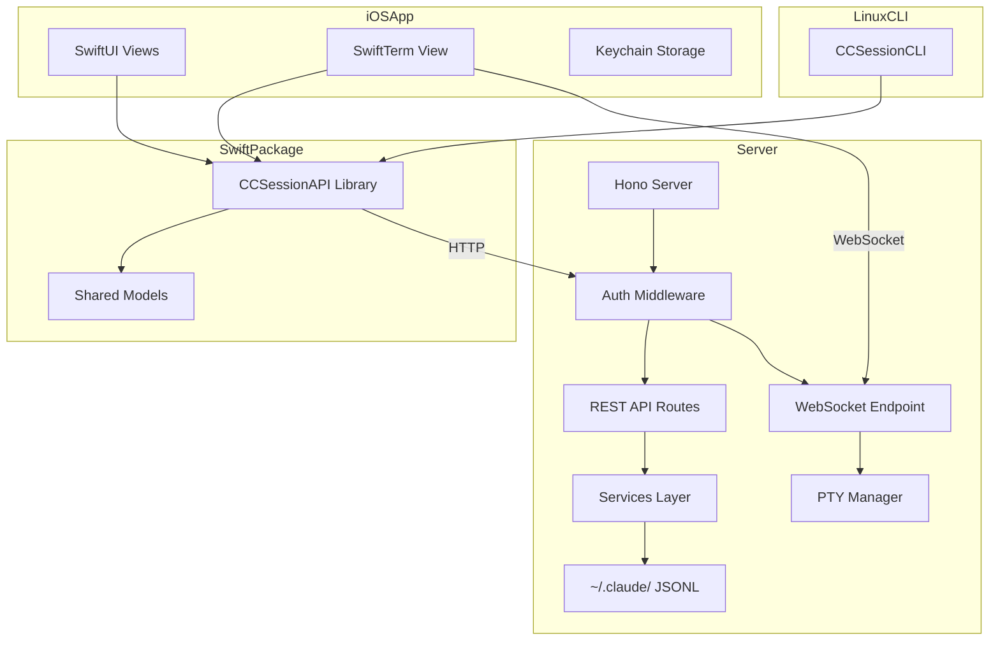
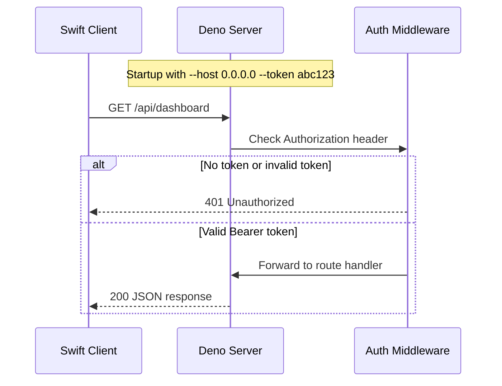
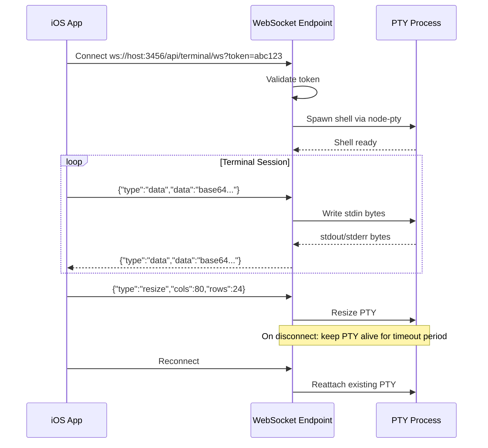

# Design Document

## Overview

**Purpose**: This feature extends CC Session Manager with network accessibility, authentication, and native Swift clients (iOS/macOS app + Linux CLI) that consume the existing Deno REST API. It also adds a WebSocket-based terminal relay enabling remote Claude Code session interaction from iOS.

**Users**: Solo developers who use Claude Code across multiple devices — reviewing sessions from iPhone/iPad, managing projects from a Mac without a browser, or browsing history from a Linux workstation.

**Impact**: The existing Deno server gains `--host` and `--token` flags for network binding and auth. A new WebSocket endpoint enables remote terminal access. The Swift clients are additive — no changes to existing frontend behavior.

### Goals
- Expose the existing API server on LAN/Tailscale with bearer token authentication
- Provide a shared Swift API client library that compiles on Apple platforms and Linux
- Build an iOS/macOS app with session browsing, transcript viewing, and remote terminal access
- Build a Linux CLI for session browsing via the remote API

### Non-Goals
- End-to-end encryption beyond HTTPS/Tailscale (transport-level security is sufficient)
- Multi-user authentication or user accounts
- Offline caching or local session data on iOS
- SSH-based terminal access (WebSocket over HTTP is simpler and firewall-friendly)
- Android client

## Architecture

### Existing Architecture Analysis

The current system is a local client-server SPA:
- **Deno server** (Hono): REST API at `/api/*`, static file serving at `/*`
- **Frontend**: Preact+HTM SPA loaded via CDN importmap
- **Data**: Reads `~/.claude/projects/` JSONL files (read-only)
- **Binding**: `127.0.0.1:3456` only, no authentication

Key patterns to preserve:
- Routes are thin, services are pure (no HTTP knowledge)
- `AppConfig` threaded through factory functions
- `src/types.ts` centralizes all interfaces
- Deno permission model enforces read-only access to `~/.claude/`

### Architecture Pattern & Boundary Map



**Architecture Integration**:
- Selected pattern: Extended client-server with shared API client library
- Domain boundaries: Server (Deno/TypeScript) | API Client (Swift) | iOS App (SwiftUI) | CLI (Swift)
- Existing patterns preserved: Routes→Services layering, AppConfig threading, centralized types
- New components: Auth middleware (Hono), WebSocket terminal endpoint, PTY manager, Swift Package
- Steering compliance: Services remain pure; routes stay thin; new endpoints follow existing factory pattern

### Technology Stack

| Layer | Choice / Version | Role in Feature | Notes |
|-------|------------------|-----------------|-------|
| Backend | Deno 2.x + Hono 4.x | API server, auth middleware, WebSocket | Existing |
| Backend PTY | `@sigma/pty-ffi` (JSR) | PTY process spawning via FFI + Rust portable-pty | New dependency |
| iOS/macOS App | SwiftUI (iOS 17+, macOS 14+) | Native UI for session browsing + terminal | New |
| Terminal Emulator | SwiftTerm (SPM) | ANSI terminal rendering in iOS/macOS | New dependency |
| API Client Library | Swift Package (Foundation URLSession) | Shared HTTP + WebSocket client | New |
| Linux CLI | Swift 5.9+ (ArgumentParser) | Command-line session browser | New |
| Auth | Bearer token (Hono middleware) | Protect API when network-exposed | New |

## System Flows

### Authentication Flow



### Terminal WebSocket Flow



## Requirements Traceability

| Requirement | Summary | Components | Interfaces | Flows |
|-------------|---------|------------|------------|-------|
| 1.1 | Host flag binding | ServerConfig, main.ts | CLI args | Startup |
| 1.2 | Default localhost | ServerConfig | CLI args | Startup |
| 1.3 | Serve API + static on configured host | server.ts | Deno.serve | Startup |
| 1.4 | Display accessible URLs | main.ts | Console output | Startup |
| 2.1 | Auth required on non-localhost | AuthMiddleware | Hono middleware | Auth flow |
| 2.2 | 401 on missing credentials | AuthMiddleware | HTTP response | Auth flow |
| 2.3 | Bearer token header | AuthMiddleware | Authorization header | Auth flow |
| 2.4 | Token generation / --token flag | ServerConfig, main.ts | CLI args, console | Startup |
| 2.5 | No auth on localhost | AuthMiddleware | Config check | Auth flow |
| 2.6 | Token as query parameter | AuthMiddleware | URL query | Auth flow |
| 3.1 | Swift Package cross-platform | CCSessionAPI | Package.swift | — |
| 3.2 | Typed API methods | CCSessionAPI | SessionClient | — |
| 3.3 | Bearer token in requests | CCSessionAPI | URLRequest | — |
| 3.4 | Typed errors | CCSessionAPI | APIError | — |
| 3.5 | async/await + Sendable | CCSessionAPI | Swift concurrency | — |
| 3.6 | Swift model types | CCSessionAPI Models | Codable structs | — |
| 4.1 | Server connection screen | ConnectionView | — | Setup |
| 4.2 | Keychain storage | KeychainService | Security.framework | — |
| 4.3 | Dashboard view | DashboardView | CCSessionAPI | — |
| 4.4 | Project list with search | ProjectListView | CCSessionAPI | — |
| 4.5 | Session list with badges | SessionListView | CCSessionAPI | — |
| 4.6 | Transcript view | TranscriptView | CCSessionAPI | — |
| 4.7 | Dark/light mode | All views | SwiftUI | — |
| 4.8 | Connection error handling | ConnectionView | CCSessionAPI | Error |
| 5.1 | WebSocket terminal endpoint | TerminalRoute | WebSocket API | Terminal flow |
| 5.2 | PTY stdin/stdout relay | PTYManager | node-pty | Terminal flow |
| 5.3 | WebSocket auth | TerminalRoute | Token query param | Auth flow |
| 5.4 | Terminal emulator view | TerminalSessionView | SwiftTerm | Terminal flow |
| 5.5 | Terminal input support | TerminalSessionView | SwiftTerm | Terminal flow |
| 5.6 | Launch via terminal | TerminalSessionView | CCSessionAPI + WS | Terminal flow |
| 5.7 | Reconnection on disconnect | TerminalSessionView | WebSocket | Terminal flow |
| 5.8 | PTY keepalive | PTYManager | Timeout config | Terminal flow |
| 6.1 | Linux Swift executable | CCSessionCLI | Package.swift | — |
| 6.2 | --server and --token args | CCSessionCLI | ArgumentParser | — |
| 6.3 | Dashboard command | CCSessionCLI | CCSessionAPI | — |
| 6.4 | Projects command | CCSessionCLI | CCSessionAPI | — |
| 6.5 | Sessions command | CCSessionCLI | CCSessionAPI | — |
| 6.6 | Transcript command | CCSessionCLI | CCSessionAPI | — |
| 6.7 | Error handling + exit codes | CCSessionCLI | Foundation.exit | — |

## Components and Interfaces

| Component | Domain/Layer | Intent | Req Coverage | Key Dependencies | Contracts |
|-----------|--------------|--------|--------------|------------------|-----------|
| ServerConfig | Server / Config | Extended config with host, token, auth flag | 1.1-1.4, 2.4-2.5 | AppConfig (P0) | State |
| AuthMiddleware | Server / Middleware | Bearer token validation on /api/* | 2.1-2.6 | Hono (P0), ServerConfig (P0) | Service |
| TerminalRoute | Server / Route | WebSocket endpoint for terminal relay | 5.1-5.3 | Hono WS (P0), PTYManager (P0) | API |
| PTYManager | Server / Service | PTY process lifecycle management | 5.1-5.2, 5.8 | node-pty (P0) | Service |
| CCSessionAPI | Swift / Library | Shared HTTP client for REST API | 3.1-3.6 | URLSession (P0) | Service, API |
| Swift Models | Swift / Library | Codable structs mirroring TS types | 3.6 | Foundation (P0) | State |
| ConnectionView | iOS / UI | Server URL + token entry, QR scan | 4.1, 4.8 | CCSessionAPI (P0), Keychain (P1) | — |
| DashboardView | iOS / UI | Stats + recent sessions | 4.3, 4.7 | CCSessionAPI (P0) | — |
| ProjectListView | iOS / UI | Filterable project list | 4.4, 4.7 | CCSessionAPI (P0) | — |
| SessionListView | iOS / UI | Session list with badges | 4.5, 4.7 | CCSessionAPI (P0) | — |
| TranscriptView | iOS / UI | Full transcript display | 4.6, 4.7 | CCSessionAPI (P0) | — |
| TerminalSessionView | iOS / UI | SwiftTerm-based terminal | 5.4-5.7 | SwiftTerm (P0), CCSessionAPI (P0) | — |
| KeychainService | iOS / Service | Persist server URL + token | 4.2 | Security.framework (P0) | Service |
| CCSessionCLI | CLI / Executable | Linux CLI entry point | 6.1-6.7 | CCSessionAPI (P0), ArgumentParser (P0) | — |

### Server / Config

#### ServerConfig (Extended AppConfig)

| Field | Detail |
|-------|--------|
| Intent | Extend AppConfig with host binding, auth token, and auth-enabled flag |
| Requirements | 1.1-1.4, 2.4-2.5 |

**Responsibilities & Constraints**
- Parse `--host` and `--token` CLI flags alongside existing flags
- Derive `authEnabled` from host value (true when host is not `127.0.0.1`)
- Generate random token when auth enabled and no `--token` provided

**Contracts**: State [x]

##### State Management
- State model: Immutable after initialization; extends existing `AppConfig`
- New fields: `host: string`, `token: string | null`, `authEnabled: boolean`

**Implementation Notes**
- Extend `loadConfig()` in `src/config.ts` to accept new flags
- Extend `AppConfig` interface in `src/types.ts`
- Update `main.ts` CLI arg parsing and startup banner

### Server / Middleware

#### AuthMiddleware

| Field | Detail |
|-------|--------|
| Intent | Validate Bearer token on all /api/* requests when auth is enabled |
| Requirements | 2.1-2.6 |

**Responsibilities & Constraints**
- Skip auth when `config.authEnabled` is false
- Check `Authorization: Bearer <token>` header first
- Fall back to `?token=<token>` query parameter
- Return 401 with JSON body on failure
- Must be registered before all API routes

**Dependencies**
- Inbound: Hono middleware chain — request pipeline (P0)
- Inbound: ServerConfig — token value and authEnabled flag (P0)

**Contracts**: Service [x]

##### Service Interface
```typescript
// Hono middleware factory
function authMiddleware(config: AppConfig): MiddlewareHandler;
// Registered as: app.use("/api/*", authMiddleware(config))
```
- Preconditions: `config.token` is non-null when `config.authEnabled` is true
- Postconditions: Request proceeds if valid, 401 JSON response if invalid

### Server / Route

#### TerminalRoute

| Field | Detail |
|-------|--------|
| Intent | WebSocket endpoint for bidirectional terminal I/O relay |
| Requirements | 5.1-5.3 |

**Responsibilities & Constraints**
- Upgrade HTTP to WebSocket at `/api/terminal/ws`
- Validate auth token from query parameter before upgrade
- Relay JSON-enveloped messages between WebSocket and PTY
- Handle disconnect with PTY keepalive

**Dependencies**
- Inbound: Hono WebSocket helper or Deno.upgradeWebSocket — upgrade mechanism (P0)
- Outbound: PTYManager — PTY lifecycle (P0)

**Contracts**: API [x]

##### API Contract

WebSocket endpoint: `GET /api/terminal/ws?token=<token>`

**Client → Server messages:**
```typescript
type ClientMessage =
  | { type: "data"; data: string }    // base64-encoded stdin bytes
  | { type: "resize"; cols: number; rows: number }
  | { type: "ping" };
```

**Server → Client messages:**
```typescript
type ServerMessage =
  | { type: "data"; data: string }    // base64-encoded stdout bytes
  | { type: "exit"; code: number }
  | { type: "pong" }
  | { type: "error"; message: string };
```

### Server / Service

#### PTYManager

| Field | Detail |
|-------|--------|
| Intent | Manage PTY process lifecycle — spawn, resize, relay I/O, keepalive |
| Requirements | 5.1-5.2, 5.8 |

**Responsibilities & Constraints**
- Spawn shell process via `@sigma/pty-ffi` with configurable shell (default: user's login shell)
- Buffer output during brief disconnects (keepalive timeout: 30s default)
- Clean up PTY on client disconnect after timeout
- Support concurrent terminal sessions (keyed by session ID)

**Dependencies**
- External: `@sigma/pty-ffi` (JSR) — PTY spawning via Deno FFI (P0)

**Contracts**: Service [x]

##### Service Interface
```typescript
interface PTYSession {
  id: string;
  write(data: Uint8Array): void;
  resize(cols: number, rows: number): void;
  onData: (callback: (data: Uint8Array) => void) => void;
  onExit: (callback: (code: number) => void) => void;
  kill(): void;
}

interface PTYManager {
  create(shell?: string, cwd?: string, env?: Record<string, string>): PTYSession;
  get(id: string): PTYSession | undefined;
  destroy(id: string): void;
}
```

### Swift / Library

#### CCSessionAPI

| Field | Detail |
|-------|--------|
| Intent | Cross-platform Swift HTTP client for all CC Session Manager REST endpoints |
| Requirements | 3.1-3.6 |

**Responsibilities & Constraints**
- Compile on Apple platforms (iOS 17+, macOS 14+) and Linux (Swift 5.9+)
- No platform-specific imports (Foundation only)
- All methods are `async throws` with `Sendable` conformance
- Decode JSON responses into typed Swift models

**Dependencies**
- External: Foundation URLSession — HTTP networking (P0)

**Contracts**: Service [x]

##### Service Interface
```swift
public final class SessionClient: Sendable {
    public init(serverURL: URL, token: String?)

    // Dashboard
    public func getDashboard() async throws -> DashboardResponse

    // Projects
    public func getProjects() async throws -> ProjectsResponse
    public func getProject(id: String) async throws -> ProjectDetailResponse
    public func getProjectSettings(id: String) async throws -> ProjectSettings
    public func updateProjectSettings(id: String, settings: ProjectSettings) async throws

    // Sessions
    public func getTranscript(sessionId: String) async throws -> TranscriptResponse

    // Launch
    public func launchSession(_ request: LaunchRequest) async throws -> LaunchResult

    // Projects
    public func createProject(_ request: CreateProjectRequest) async throws -> CreateProjectResult
}
```

#### Swift Models

| Field | Detail |
|-------|--------|
| Intent | Codable structs mirroring TypeScript API response types |
| Requirements | 3.6 |

**Key types** (mirror `src/types.ts`):

```swift
public struct DashboardStats: Codable, Sendable {
    public let projects: Int
    public let sessions: Int
    public let active7d: Int
    public let tokens30d: Int
}

public struct ProjectSummary: Codable, Sendable, Identifiable {
    public let id: String
    public let path: String
    public let displayName: String
    public let sessionCount: Int
    public let lastActivity: String
    public let isWorktree: Bool
}

public struct SessionSummary: Codable, Sendable, Identifiable {
    public let id: String
    public let projectId: String
    public let summary: String
    public let messageCount: Int
    public let toolCallCount: Int
    public let firstTimestamp: String
    public let lastTimestamp: String
    public let gitBranch: String?
    public let model: String?
    public let totalTokens: Int
    public let subAgentCount: Int
    public let lastMessage: String?
    public let webUrl: String?
    public let isActive: Bool
    public let isRemoteConnected: Bool
    public let entrypoint: String?
    public let aiSummary: String?
}

public struct TranscriptEntry: Codable, Sendable, Identifiable {
    public let uuid: String
    public let type: String  // "user" | "assistant" | "system"
    public let text: String?
    public let toolCalls: [ToolCallEntry]
    public let model: String?
    public let timestamp: String
    public let tokens: TokenInfo?
    public var id: String { uuid }
}

public struct ToolCallEntry: Codable, Sendable, Identifiable {
    public let id: String
    public let name: String
    public let input: [String: AnyCodable]
    public let result: String?
    public let isError: Bool?
}

public enum APIError: Error, Sendable {
    case unauthorized
    case notFound(String)
    case serverError(statusCode: Int, message: String)
    case networkError(Error)
    case decodingError(Error)
}
```

### iOS / UI Components

iOS/macOS views follow standard SwiftUI patterns. Summary-level descriptions only (no new boundaries):

- **ConnectionView** (4.1, 4.8): Server URL text field, token field, optional QR code scanner (via `AVFoundation`). Shows connection status and error. Saves to Keychain on success.
- **DashboardView** (4.3): Fetches `/api/dashboard`, displays stat cards and recent session list. Pull-to-refresh.
- **ProjectListView** (4.4): Fetches `/api/projects`, displays searchable list. Navigation to project detail.
- **SessionListView** (4.5): Fetches `/api/projects/:id`, displays sessions with ACTIVE/REMOTE badges, message count, model, branch.
- **TranscriptView** (4.6): Fetches `/api/sessions/:id/transcript`, renders messages in a scrollable list with collapsible tool calls and thinking blocks.
- **TerminalSessionView** (5.4-5.7): Wraps SwiftTerm's `TerminalView` in a SwiftUI representable. Connects via WebSocket to `/api/terminal/ws`. Sends resize events on layout changes.

**Implementation Note**: All views support dark/light mode via SwiftUI's automatic appearance handling (4.7). Navigation uses `NavigationStack` with programmatic routing.

### iOS / Service

#### KeychainService

| Field | Detail |
|-------|--------|
| Intent | Persist server URL and auth token securely in iOS/macOS Keychain |
| Requirements | 4.2 |

**Contracts**: Service [x]

##### Service Interface
```swift
struct ServerConnection: Codable {
    let serverURL: URL
    let token: String
}

enum KeychainService {
    static func save(_ connection: ServerConnection) throws
    static func load() throws -> ServerConnection?
    static func delete() throws
}
```

### CLI / Executable

#### CCSessionCLI

| Field | Detail |
|-------|--------|
| Intent | Linux command-line tool for browsing sessions via remote API |
| Requirements | 6.1-6.7 |

**Responsibilities & Constraints**
- Swift executable using ArgumentParser for subcommand routing
- Uses CCSessionAPI for all API calls
- Formats output as human-readable text tables
- Exits with code 1 on errors

**Dependencies**
- Inbound: CCSessionAPI — API client (P0)
- External: swift-argument-parser (SPM) — CLI parsing (P0)

**Implementation Notes**
- Subcommands: `dashboard`, `projects`, `sessions <project-id>`, `transcript <session-id>`
- Global options: `--server <url>`, `--token <token>`
- No WebSocket/terminal support (Linux CLI is read-only browser)

## Data Models

### Domain Model

No new persistent data models. The system remains read-only for `~/.claude/` data. New state:

- **Server config** (runtime): Extended `AppConfig` with host, token, authEnabled — ephemeral, derived from CLI flags
- **PTY sessions** (runtime): In-memory map of active PTY processes — ephemeral, cleaned up on disconnect/shutdown
- **Keychain entry** (iOS): Single `ServerConnection` record — persisted in iOS Keychain

### Data Contracts & Integration

**API Data Transfer**: All existing REST endpoints use JSON. No schema changes to existing responses. New WebSocket endpoint uses the JSON envelope format defined in TerminalRoute's API Contract.

**Serialization**: Swift models use `Codable` with `JSONDecoder` configured for the existing camelCase JSON keys (TypeScript's default). The `snakeCase` strategy is NOT used — the TypeScript API already outputs camelCase.

## Error Handling

### Error Strategy
- **Server auth errors**: Return JSON `{ "error": "Unauthorized" }` with 401 status. No information leakage about valid tokens.
- **WebSocket errors**: Send `{ "type": "error", "message": "..." }` frame before closing connection.
- **PTY errors**: If shell fails to spawn, send error frame and close WebSocket. If PTY exits, send `{ "type": "exit", "code": N }`.
- **Swift client errors**: `APIError` enum with cases for unauthorized, notFound, serverError, networkError, decodingError. All errors carry context for display.

### Error Categories and Responses
- **401 Unauthorized**: Missing/invalid token → iOS shows connection error, CLI exits with code 1
- **Network unreachable**: URLSession timeout → iOS shows retry button, CLI prints error
- **WebSocket disconnect**: iOS shows reconnection notice, auto-retries with exponential backoff (max 3 attempts)
- **PTY crash**: Server sends exit frame, iOS shows "Session ended" message

## Testing Strategy

### Unit Tests (Server - Deno)
- Auth middleware: valid token, invalid token, missing token, query param token, localhost bypass
- Config: `--host` and `--token` flag parsing, default values, token generation
- PTY manager: session creation, lookup, destroy, timeout cleanup

### Integration Tests (Server - Deno)
- Auth middleware with Hono `app.request()`: protected endpoints return 401 without token, 200 with token
- Terminal WebSocket: connection upgrade, message relay (mock PTY)
- Existing API routes continue to work with auth disabled (backward compat)

### Unit Tests (Swift)
- `SessionClient`: URL construction, header injection, error mapping (mock URLSession via protocol)
- Swift model decoding: verify all Codable types decode correctly from sample JSON fixtures
- `KeychainService`: save/load/delete cycle (mock Keychain on Linux)

### E2E Tests
- iOS app: Connect to test server, browse dashboard, view transcript
- CLI: Run against test server, verify formatted output for each subcommand

## Security Considerations

- **Token entropy**: Auto-generated tokens use `crypto.getRandomValues()` with 32 bytes, hex-encoded (256-bit entropy)
- **Token in URL**: `?token=` query parameter is logged in server access logs and browser history. Acceptable for initial setup flow; clients switch to header-based auth after connection.
- **PTY security**: WebSocket terminal has full shell access on the server. Auth token is the sole protection. Users must understand the risk when using `--host 0.0.0.0`.
- **Tailscale**: When used over Tailscale, traffic is encrypted end-to-end. No additional TLS needed.
- **Permission expansion**: `--allow-net` must be broadened from `127.0.0.1:3456` to `0.0.0.0:3456` when `--host` is set. `--allow-ffi` is needed for `@sigma/pty-ffi`. Document these changes.
