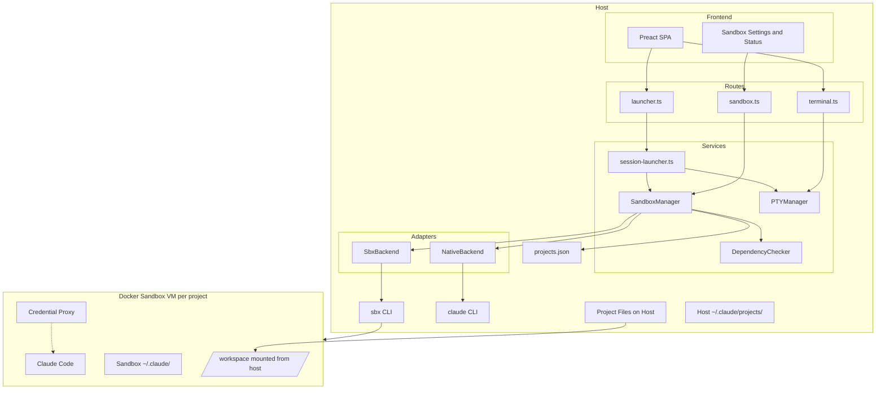
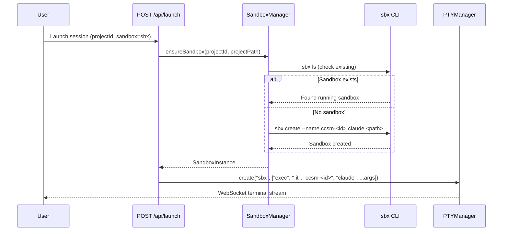
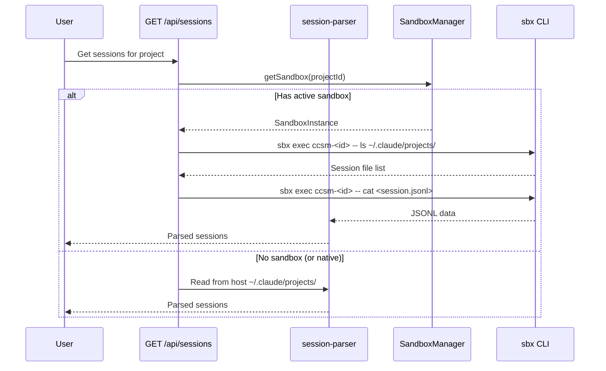
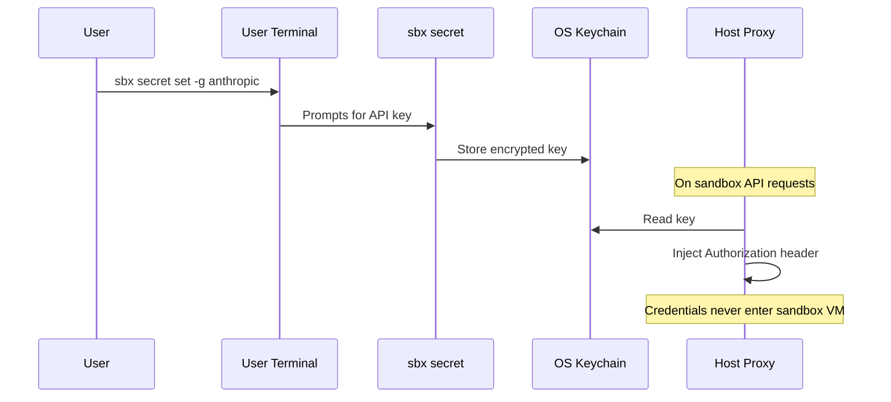
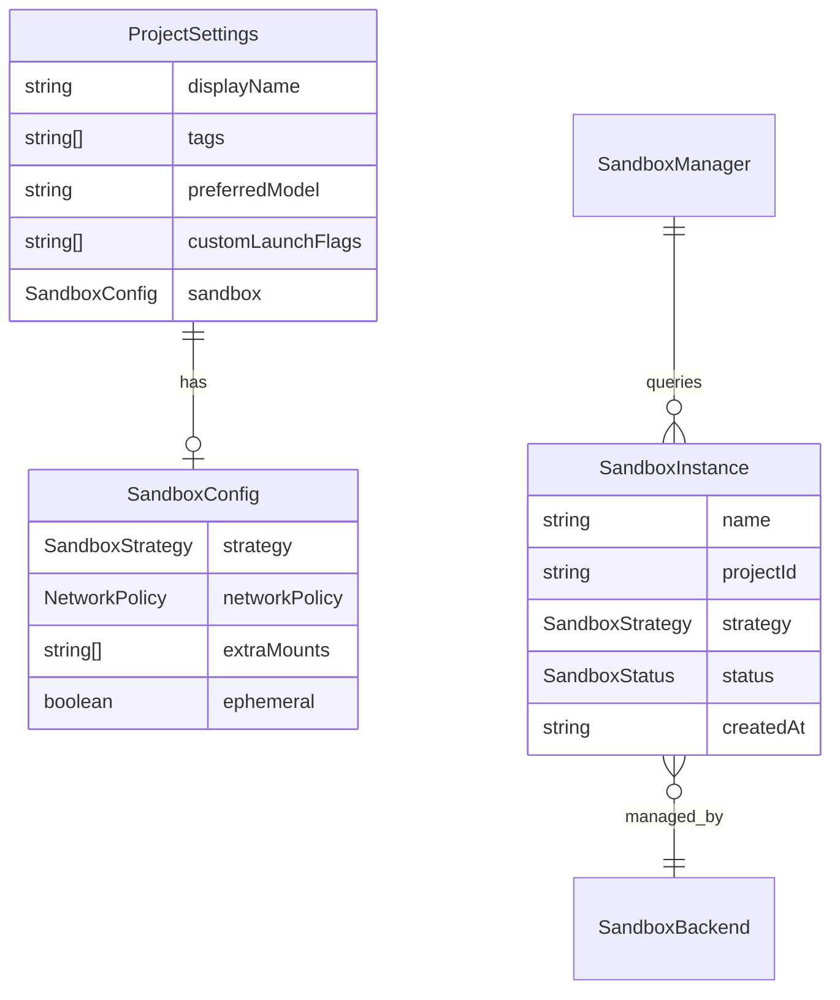

# Technical Design: Sandbox

## Overview

**Purpose**: This feature adds per-project sandboxing to the Session Manager using Docker Sandbox (`sbx` CLI) as the primary backend, with Claude Code's native Seatbelt sandbox as a lightweight fallback. Each project gets its own isolated sandbox VM with secure credential handling via Docker Sandbox's host-side proxy.

**Users**: Developers using the Session Manager to launch and manage Claude Code sessions with isolation between projects and protection of the host system.

**Impact**: Adds a `SandboxManager` service with `SandboxBackend` adapters, extends the launch flow to route through `sbx exec`, and adds sandbox lifecycle management API and UI components. The Deno server remains on the host with minimal permission expansion (`--allow-run=sbx`).

### Goals
- Launch a Docker Sandbox per project with `sbx create/run`, using `sbx exec` for all terminal interactions
- Secure credential handling via Docker Sandbox's proxy — no API keys in session manager code
- Browse sandboxed session data via `sbx exec` reads
- Native Seatbelt sandbox as zero-setup fallback for users without Docker Desktop
- Deno server stays on host with limited permissions

### Non-Goals
- Custom Seatbelt profile authoring UI
- Windows or WSL2-specific backends
- Cloud-based sandbox providers
- Real-time resource monitoring (CPU/memory graphs)
- Persisting session data from removed sandboxes (accepted trade-off: session data is transient within sandbox)

## Architecture

### Existing Architecture Analysis

The session manager follows a **routes → services** layered architecture:

- **Launch flow**: `POST /api/launch` → `launchSession()` → `launchInTerminal()` / `launchInBrowser()`. Stateless, fire-and-forget.
- **PTY flow**: WebSocket `/api/terminal/ws` → `PTYManager.create(shell, cwd, env)` → FFI PTY. Already supports custom commands and working directories.
- **Settings**: `ProjectSettings` persisted in `$PROJECTS_ROOT/.session-manager/projects.json`.
- **Config**: `AppConfig` created once in `main.ts`, threaded through factories.

Patterns preserved: route factory functions, centralized types in `src/types.ts`, `{ ok, error }` result pattern, dynamic imports for heavy dependencies.

### Architecture Pattern & Boundary Map



**Key architectural decisions**:
- **Deno server on host**: Reads `~/.claude/projects/` directly for non-sandboxed session browsing. Only `sbx` is added to `--allow-run`.
- **`sbx` as source of truth**: `sbx ls` provides live sandbox state — no need for `sandboxes.json` persistence. The session manager queries `sbx ls` on demand.
- **PTY via `sbx exec`**: Terminal sessions run `sbx exec -it <name> <command>` as the PTY command, reusing existing WebSocket terminal infrastructure.
- **Credential proxy**: Docker Sandbox's host-side proxy intercepts outbound API requests and injects credentials stored in OS keychain. Session manager has zero credential code.

### Technology Stack

| Layer | Choice / Version | Role in Feature | Notes |
|-------|------------------|-----------------|-------|
| Backend Services | TypeScript / Deno 2.x | SandboxManager, backend adapters, dependency checker | Existing stack |
| Backend Routes | Hono | Sandbox CRUD API, extended launch route | Route factory pattern |
| External CLI | `sbx` (Docker Desktop) | Primary sandbox lifecycle management | Requires Docker Desktop |
| External CLI | `claude` | Native sandbox via `--settings` flag | Fallback, no Docker needed |
| Frontend | Preact + HTM | Sandbox settings, status badges, management panel | No build step |

## System Flows

### Per-Project Sandbox Launch



### Sandbox Session Data Read



### Credential Setup (One-Time)



## Requirements Traceability

| Requirement | Summary | Components | Interfaces | Flows |
|-------------|---------|------------|------------|-------|
| 1.1 | Supported strategies | SandboxManager, types | SandboxStrategy type | — |
| 1.2 | Dependency verification | DependencyChecker | check() | — |
| 1.3 | Missing dependency error | DependencyChecker, SandboxRoute | DependencyStatus | — |
| 1.4 | Global default + per-project | AppConfig, ProjectSettings | SandboxConfig | — |
| 1.5 | Default none + recommendation | SandboxRoute, Frontend | — | — |
| 2.1 | Dedicated sandbox per project | SandboxManager, SbxBackend | ensureSandbox() | Launch flow |
| 2.2 | Filesystem write scoping | SbxBackend (VM isolation) | Workspace mount | — |
| 2.3 | Cross-project prevention | SbxBackend (separate VMs) | Named sandboxes | — |
| 2.4 | Cleanup on destroy | SandboxManager | destroy() via sbx rm | Lifecycle |
| 2.5 | Per-project config | ProjectSettings | SandboxConfig | — |
| 3.1 | Whole-app sandbox mode | Dockerfile.sandbox | — | Docker build/run |
| 3.2 | Mount ~/.claude RO, PROJECTS_ROOT RW | Dockerfile.sandbox | — | — |
| 3.3 | Full functionality in sandbox | Dockerfile.sandbox | — | — |
| 3.4 | Documented command | deno task start:sandbox | — | — |
| 3.5 | Global sandbox indicator | Frontend header | insideContainer flag | — |
| 4.1 | Native sandbox launch | NativeBackend | launchCommand() | Launch flow |
| 4.2 | Native sandbox detection | DependencyChecker | checkNative() | — |
| 4.3 | Native sandbox failure warning | NativeBackend, Frontend | — | — |
| 4.4 | Project dir as write scope | NativeBackend | sandbox.filesystem config | — |
| 5.1 | Docker container with volume | SbxBackend | sbx create with workspace | Launch flow |
| 5.2 | Devcontainer detection | SbxBackend | Check .devcontainer/ | — |
| 5.3 | Configurable base image | ProjectSettings | SandboxConfig | — |
| 5.4 | Container stop/remove | SbxBackend | sbx stop/rm | Lifecycle |
| 5.5 | Docker daemon error | DependencyChecker | checkSbx() | — |
| 6.1 | Docker Sandbox create | SbxBackend | sbx create --name | Launch flow |
| 6.2 | Network policy config | SbxBackend | sbx network policy flags | — |
| 6.3 | Sandbox ID capture | SbxBackend | sbx create output | — |
| 6.4 | List/stop/destroy from UI | SandboxRoute, Frontend | CRUD API | Lifecycle |
| 6.5 | Docker Sandbox detection | DependencyChecker | sbx --version | — |
| 7.1-7.5 | Lima microVM | LimaBackend (secondary) | limactl CLI | — |
| 8.1 | CRUD API endpoints | SandboxRoute | REST API | Lifecycle |
| 8.2 | Sandbox status display | Frontend | SandboxStatus | — |
| 8.3 | Launch within sandbox | Launcher, SandboxManager | sbx exec | Launch flow |
| 8.4 | Error display | Frontend, SandboxRoute | — | — |
| 8.5 | Ephemeral mode | SandboxManager | sbx rm on session exit | Lifecycle |
| 8.6 | Resource metadata | SandboxManager | sbx ls output | — |
| 9.1 | Network policy | SandboxConfig | networkPolicy field | — |
| 9.2 | Additional mounts | SandboxConfig | sbx workspace :ro | — |
| 9.3 | CPU/memory limits | SandboxConfig | (Docker Desktop controls) | — |
| 9.4 | Policy in settings | ProjectSettings | SandboxConfig | — |
| 9.5 | Policy application + logging | SbxBackend | sbx create flags | — |
| 10.1 | Sandbox indicator | Frontend | SandboxBadge | — |
| 10.2 | Sandbox details | Frontend | SandboxDetail | — |
| 10.3 | Strategy distinction | Frontend | Strategy icons | — |
| 10.4 | Global indicator | Frontend header | insideContainer | — |
| 10.5 | Dashboard summary | DashboardRoute, Frontend | activeSandboxes | — |

## Components and Interfaces

| Component | Domain/Layer | Intent | Req Coverage | Key Dependencies | Contracts |
|-----------|-------------|--------|--------------|------------------|-----------|
| SandboxManager | Service | Manages sandbox lifecycle, delegates to backends, queries sbx ls | 1, 2, 8 | SbxBackend (P0), NativeBackend (P1) | Service |
| DependencyChecker | Service | Detects sbx, claude, sandbox-exec availability | 1.2, 1.3, 4.2, 5.5, 6.5 | External CLIs (P0) | Service |
| SbxBackend | Service/Adapter | Primary backend — wraps sbx CLI for Docker Sandbox lifecycle | 2, 5, 6, 9 | sbx CLI (P0) | Service |
| NativeBackend | Service/Adapter | Fallback — launches Claude Code with --settings sandbox config | 4 | claude CLI (P0) | Service |
| SandboxRoute | Route | REST API for sandbox CRUD and status | 8, 6.4 | SandboxManager (P0) | API |
| SandboxSettings | Frontend | Per-project sandbox config form | 1.4, 2.5, 9 | api.js (P1) | — |
| SandboxBadge | Frontend | Status indicator on project list | 10 | api.js (P1) | — |

### Services

#### SandboxManager

| Field | Detail |
|-------|--------|
| Intent | Owns sandbox lifecycle, queries sbx for live state, delegates to backend adapters |
| Requirements | 1.1, 1.4, 1.5, 2.1, 2.4, 8.1-8.6 |

**Responsibilities & Constraints**
- Creates, stops, and removes sandboxes via the appropriate backend adapter
- Queries `sbx ls` for live sandbox state (no local state file needed — sbx is source of truth)
- Resolves sandbox name from projectId using convention: `ccsm-<sanitized-projectId>`
- Reads sandboxed session data via `sbx exec` when browsing projects with active sandboxes

**Dependencies**
- Inbound: SandboxRoute — CRUD (P0); session-launcher — ensureSandbox (P0); session routes — data proxy (P0)
- Outbound: SbxBackend / NativeBackend — lifecycle (P0); DependencyChecker — validation (P1)

**Contracts**: Service [x]

##### Service Interface
```typescript
interface SandboxManagerService {
  getAvailableStrategies(): Promise<StrategyAvailability[]>;
  ensureSandbox(projectId: string, projectPath: string, config: SandboxConfig): Promise<SandboxResult<SandboxInstance>>;
  getSandbox(projectId: string): Promise<SandboxInstance | null>;
  listSandboxes(): Promise<SandboxInstance[]>;
  stopSandbox(sandboxName: string): Promise<SandboxResult>;
  removeSandbox(sandboxName: string): Promise<SandboxResult>;
  execInSandbox(sandboxName: string, command: string[]): Promise<SandboxResult<string>>;
  getLaunchCommand(instance: SandboxInstance, claudeArgs: string[]): LaunchCommand;
}
```
- Preconditions: Backend for requested strategy must be available (checked via DependencyChecker)
- Postconditions: Sandbox exists and is in running state after ensureSandbox
- Invariants: One sandbox per project (naming convention enforces this)

#### DependencyChecker

| Field | Detail |
|-------|--------|
| Intent | Probes system for available sandbox runtimes, caches results |
| Requirements | 1.2, 1.3, 4.2, 5.5, 6.5 |

**Contracts**: Service [x]

##### Service Interface
```typescript
interface DependencyCheckerService {
  checkAll(): Promise<Record<SandboxStrategy, DependencyStatus>>;
  check(strategy: SandboxStrategy): Promise<DependencyStatus>;
}

interface DependencyStatus {
  available: boolean;
  version: string | null;
  error: string | null;
  installHint: string | null;
}
```
- Detection commands:
  - `sbx` (docker-sandbox): `sbx --version`
  - `native`: Check `Deno.build.os === "darwin"` + `sandbox-exec` exists, or Linux + `bwrap` exists
  - `docker`: `docker info --format '{{.ServerVersion}}'`
  - `lima`: `limactl --version`
  - `devcontainer`: `devcontainer --version`

#### SbxBackend

| Field | Detail |
|-------|--------|
| Intent | Wraps `sbx` CLI for Docker Sandbox create/exec/stop/rm |
| Requirements | 2, 5, 6, 9 |

**Contracts**: Service [x]

##### Service Interface
```typescript
interface SandboxBackend {
  readonly strategy: SandboxStrategy;
  create(sandboxName: string, projectPath: string, config: SandboxConfig): Promise<SandboxResult<SandboxInstance>>;
  stop(sandboxName: string): Promise<SandboxResult>;
  remove(sandboxName: string): Promise<SandboxResult>;
  list(): Promise<SandboxInstance[]>;
  exec(sandboxName: string, command: string[]): Promise<SandboxResult<string>>;
  getLaunchCommand(sandboxName: string, claudeArgs: string[]): LaunchCommand;
}
```

**Implementation Notes — SbxBackend**
- `create()`: `sbx create --name <name> claude <projectPath>` with optional extra workspaces as `:ro` mounts
- `stop()`: `sbx stop <name>`
- `remove()`: `sbx rm <name>`
- `list()`: `sbx ls` — parse output for sandbox name, status, resource info
- `exec()`: `sbx exec -it <name> <command>` — returns stdout
- `getLaunchCommand()`: returns `{ command: "sbx", args: ["exec", "-it", name, "claude", ...claudeArgs] }` — this is the PTY command

**Implementation Notes — NativeBackend**
- `create()`: Generates settings JSON at `$PROJECTS_ROOT/.session-manager/sandbox-settings/<projectId>.json` with `sandbox.enabled: true` and filesystem scoping
- `getLaunchCommand()`: returns `{ command: "claude", args: ["--settings", settingsPath, ...claudeArgs] }`
- No persistent instance — sandbox is per-process, managed by Claude Code
- Session data written to host's `~/.claude/projects/` (no visibility issue)

### Routes

#### SandboxRoute

| Field | Detail |
|-------|--------|
| Intent | REST API for sandbox lifecycle and status |
| Requirements | 8.1-8.6, 6.4 |

**Contracts**: API [x]

##### API Contract

| Method | Endpoint | Request | Response | Errors |
|--------|----------|---------|----------|--------|
| GET | /api/sandbox/strategies | — | `{ strategies: StrategyAvailability[] }` | 500 |
| GET | /api/sandbox/instances | — | `{ instances: SandboxInstance[] }` | 500 |
| GET | /api/sandbox/instances/:projectId | — | `{ instance: SandboxInstance \| null }` | 404, 500 |
| POST | /api/sandbox/instances | `{ projectId, projectPath, strategy?, config? }` | `{ ok, instance }` | 400, 500 |
| POST | /api/sandbox/instances/:name/stop | — | `{ ok }` | 404, 500 |
| DELETE | /api/sandbox/instances/:name | — | `{ ok }` | 404, 500 |
| POST | /api/sandbox/instances/:name/exec | `{ command: string[] }` | `{ ok, output }` | 404, 500 |

#### Extended Launch Route

Extends existing `POST /api/launch` with optional `sandbox` field:

```typescript
interface LaunchRequest {
  // ... existing fields ...
  sandbox?: SandboxStrategy;
}
```

When `sandbox` is set (and not `"none"`), the launch route calls `SandboxManager.ensureSandbox()` then uses `getLaunchCommand()` to get the `sbx exec` command for PTY.

### Frontend (Summary-only)

| Component | Intent | Req Coverage |
|-----------|--------|--------------|
| SandboxSettings | Form to select strategy and configure network policy per project | 1.4, 2.5, 9.1-9.4 |
| SandboxBadge | Icon/badge on project list showing sandbox status | 10.1, 10.3 |
| SandboxDetail | Panel showing sandbox details: strategy, status, resource info | 10.2, 8.2 |
| SandboxPanel | Management controls: create, stop, remove sandbox | 8.3-8.4, 6.4 |
| GlobalSandboxIndicator | Header badge when whole-app sandbox mode active | 3.5, 10.4 |
| DashboardSandboxSummary | Sandbox count by type on dashboard | 10.5 |
| CredentialSetupGuide | One-time setup instructions for `sbx secret set -g anthropic` | 6.1 |

## Data Models

### Domain Model



### Logical Data Model

**New types added to `src/types.ts`**:

```typescript
// ─── Sandbox types ───

type SandboxStrategy = "none" | "native" | "sbx";

type SandboxStatus = "running" | "stopped" | "not-found";

type NetworkPolicy = "open" | "balanced" | "restricted";

interface SandboxConfig {
  strategy: SandboxStrategy;
  networkPolicy: NetworkPolicy;
  extraMounts: string[];
  ephemeral: boolean;
}

interface SandboxInstance {
  name: string;
  projectId: string;
  strategy: SandboxStrategy;
  status: SandboxStatus;
  info: string | null;
}

interface StrategyAvailability {
  strategy: SandboxStrategy;
  available: boolean;
  version: string | null;
  installHint: string | null;
}

interface LaunchCommand {
  command: string;
  args: string[];
  cwd: string | null;
  env: Record<string, string>;
}

interface SandboxResult<T = void> {
  ok: boolean;
  data?: T;
  error?: string;
  errorCode?: SandboxErrorCode;
}

type SandboxErrorCode =
  | "DEPENDENCY_MISSING"
  | "BACKEND_ERROR"
  | "SANDBOX_EXISTS"
  | "SANDBOX_NOT_FOUND"
  | "EXEC_FAILED";

// ─── Extended existing types ───

interface ProjectSettings {
  // ... existing fields ...
  sandbox?: SandboxConfig;
}

interface AppConfig {
  // ... existing fields ...
  defaultSandboxStrategy: SandboxStrategy;
  insideContainer: boolean;
}

interface DashboardStats {
  // ... existing fields ...
  activeSandboxes: number;
}

interface LaunchRequest {
  // ... existing fields ...
  sandbox?: SandboxStrategy;
}
```

### Physical Data Model

**No `sandboxes.json` needed** — `sbx ls` is the live source of truth for sandbox state. Only `projects.json` is extended with `SandboxConfig` per project.

**Dockerfile.sandbox** (project root, for whole-app sandboxing — Req 3):
```dockerfile
FROM denoland/deno:2.0.0
RUN deno install -g npm:@anthropic-ai/claude-code
WORKDIR /app
COPY . .
EXPOSE 3456
ENV CCSM_INSIDE_CONTAINER=1
CMD ["deno", "task", "start:network", "--host", "0.0.0.0"]
```

## Error Handling

### Error Strategy
- All service operations return `SandboxResult<T>` — matches existing `{ ok, error }` pattern with optional `data` and `errorCode`
- CLI subprocess failures capture stderr in `error` field
- Dependency check failures produce actionable `installHint` strings

### Error Categories and Responses

**User Errors (400)**: Invalid strategy, invalid project ID, sandbox name collision
**System Errors (500)**: `sbx` CLI failure (capture stderr), Docker Desktop not running, timeout during create
**Business Logic (409/422)**: Sandbox already exists for project → return existing; sandbox not running → suggest create

## Testing Strategy

### Unit Tests (`tests/sandbox-manager.test.ts`)
- `ensureSandbox` with mock sbx CLI responses
- `listSandboxes` parsing sbx ls output
- `execInSandbox` with mock command output
- Sandbox name generation from projectId

### Unit Tests (`tests/dependency-checker.test.ts`)
- Detection with mocked Deno.Command (sbx --version, sandbox-exec)
- Caching behavior
- Missing dependency install hints

### Unit Tests (`tests/sbx-backend.test.ts`)
- create/stop/remove with mocked sbx CLI calls
- getLaunchCommand output for various args
- list parsing
- Error handling for failed subprocess

### Integration Tests (`tests/sandbox-api.test.ts`)
- Sandbox CRUD endpoints via Hono `app.request()`
- Extended launch endpoint with sandbox parameter
- Dashboard stats with sandbox count

## Security Considerations

- **Credential isolation**: Docker Sandbox proxy handles all API authentication. Credentials stored in OS keychain via `sbx secret`. Session manager has zero credential-related code.
- **Deno permission expansion**: New `deno task dev:sandbox` / `start:sandbox` variants add only `--allow-run=sbx` — follows existing `dev:network` pattern for incremental permission grants.
- **Sandbox name injection**: `projectId` used in sandbox names sanitized to `[a-zA-Z0-9-]` to prevent command injection in `sbx create --name`.
- **Session data boundary**: Sandboxed session data stays inside the VM. Session manager reads via `sbx exec` — no host filesystem crossover beyond the mounted workspace.
- **`--dangerously-skip-permissions`**: Docker Sandbox template runs Claude Code with this flag internally (acceptable because VM-level isolation replaces process-level permissions).
- **Whole-app sandbox**: `Dockerfile.sandbox` preserves `--deny-write=$HOME/.claude`; mounts `~/.claude` RO for session browsing, `PROJECTS_ROOT` RW for project files.
