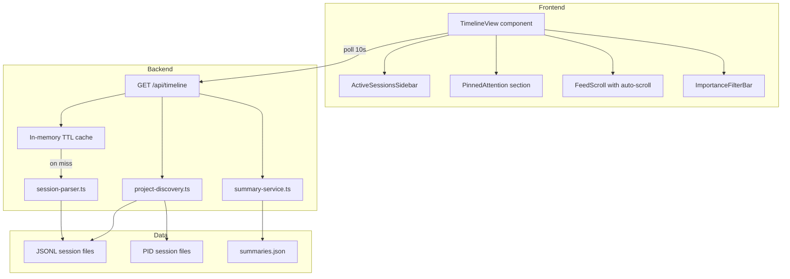
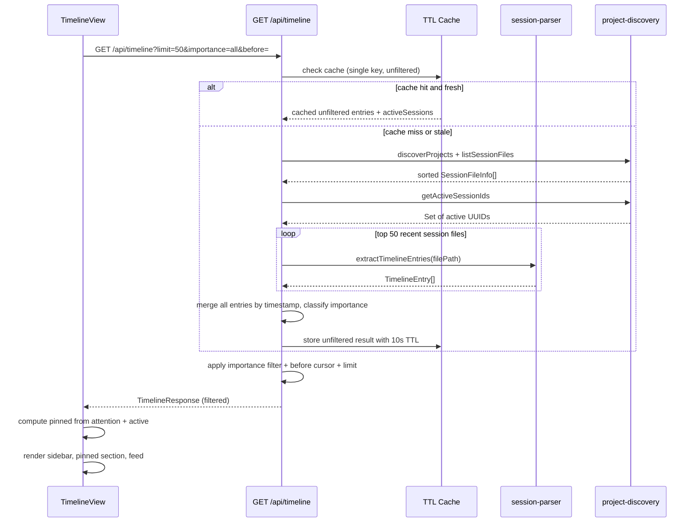
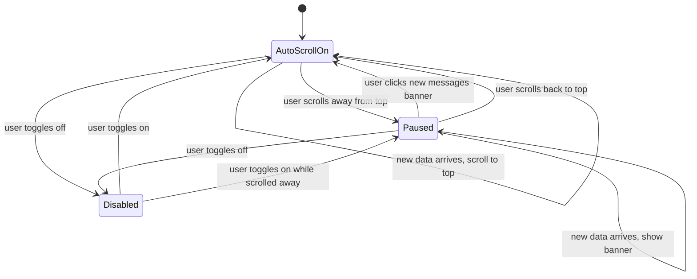
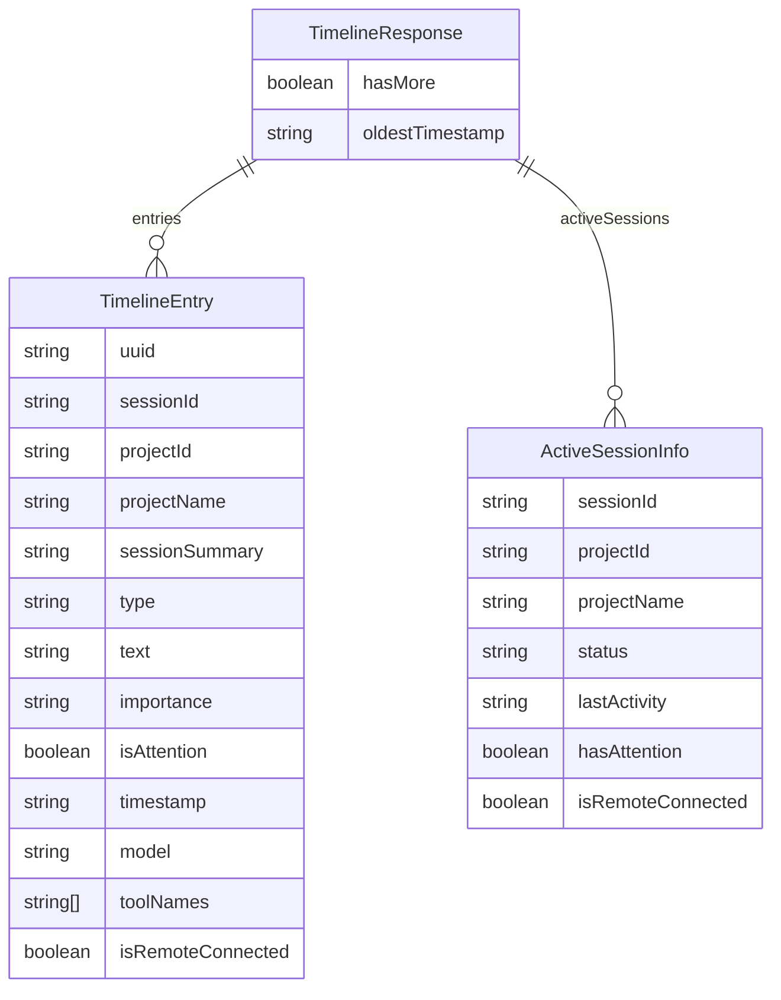

# Design Document — Timeline

## Overview

**Purpose**: The timeline feature delivers a unified, real-time-ish feed of Claude Code messages across all projects and sessions, enabling developers to passively monitor multi-session activity from a single view.

**Users**: Developers running multiple concurrent Claude Code sessions use the timeline to track progress, catch permission prompts or questions, and quickly identify sessions that need attention — without switching between individual transcripts.

**Impact**: Adds a new `/timeline` route (backend + frontend), new types, a new service function in session-parser, and introduces polling as a new frontend pattern.

### Goals
- Chronological cross-session message feed with importance filtering
- Pinned attention-required messages for active sessions
- Active sessions sidebar with presence indicators and notification dots
- Auto-scrolling with pause-on-scroll and manual toggle

### Non-Goals
- SSE or WebSocket push (polling is sufficient for v1)
- Full-text search across timeline messages (deferred)
- Historical timeline beyond loaded sessions (no infinite back-scroll into archived data)
- Interaction with sessions from the timeline (no inline reply or approval — click through to transcript)

## Architecture

### Existing Architecture Analysis

The app follows a **routes → services** layered pattern. Routes are thin HTTP handlers; services are pure functions. The frontend is a hash-routed Preact SPA with no build step. All data flows through REST API calls from frontend `useEffect` hooks. No live-update mechanism exists today.

Key patterns to preserve:
- Route factory pattern: `xxxRoutes(config: AppConfig): Hono`
- Service functions: pure, no HTTP knowledge, receive config/paths as params
- Frontend: htm tagged templates, `useState`/`useEffect`, signals for shared state
- Types centralized in `src/types.ts`

### Architecture Pattern & Boundary Map



**Architecture Integration**:
- Selected pattern: Extension of existing routes/services layered architecture with REST polling
- Domain boundaries: Timeline route aggregates data from existing services; no new service file needed
- Existing patterns preserved: Route factory, pure service functions, centralized types, hash-based routing
- New components: `timeline.ts` route, `timeline.js` frontend component, new types in `types.ts`
- Steering compliance: Follows routes-are-thin, services-are-pure, no-build-step principles

### Technology Stack

| Layer | Choice / Version | Role in Feature | Notes |
|-------|------------------|-----------------|-------|
| Frontend | Preact + HTM (CDN) | TimelineView component, polling, auto-scroll | No new deps |
| Frontend state | `@preact/signals` | Shared auto-scroll toggle signal | Already used for routing |
| Backend | Hono 4.x (JSR) | Timeline route handler | Existing framework |
| Data parsing | `session-parser.ts` | New `extractTimelineEntries()` function | Extension of existing |
| Caching | In-memory Map | TTL-based response cache (10s) | No new deps |
| Runtime | Deno 2.x | Existing runtime | No changes |

## System Flows

### Timeline Data Flow



### Auto-Scroll Behavior



## Requirements Traceability

| Requirement | Summary | Components | Interfaces | Flows |
|-------------|---------|------------|------------|-------|
| 1.1 | Chronological feed from all sessions | TimelineRoute, FeedScroll | GET /api/timeline | Timeline Data Flow |
| 1.2 | Entry displays project, session, timestamp, preview | TimelineEntry type, FeedEntry | TimelineEntry interface | — |
| 1.3 | Load more on scroll | FeedScroll (pagination via `before` cursor) | GET /api/timeline?before= | — |
| 1.4 | Aggregate without project selection | TimelineRoute | — | Timeline Data Flow |
| 1.5 | Click entry navigates to transcript | FeedEntry | navigate() | — |
| 2.1 | Importance classification | classifyImportance() | TimelineEntry.importance | — |
| 2.2 | Filter by importance level | FilterBar, TimelineRoute | ?importance= param | — |
| 2.3 | Default shows all levels | FilterBar | — | — |
| 2.4 | Filter updates without reload | FilterBar | client-side re-fetch | — |
| 2.5 | Visual importance indicator | FeedEntry | importance-bar CSS class | — |
| 3.1 | Identify attention-required messages | classifyImportance() | TimelineEntry.isAttention | — |
| 3.2 | Distinct visual styling for attention | FeedEntry | .feed-entry.attention CSS | — |
| 3.3 | Notification on sidebar for attention | ActiveSessionsSidebar | attention-dot element | — |
| 3.4 | High filter includes attention messages | FilterBar + classifyImportance() | — | — |
| 4.1 | Sidebar lists active sessions | ActiveSessionsSidebar | TimelineResponse.activeSessions | Timeline Data Flow |
| 4.2 | Session with status and time | ActiveSessionsSidebar | ActiveSessionInfo type | — |
| 4.3 | Attention badge on sidebar | ActiveSessionsSidebar | hasAttention field | — |
| 4.4 | Click sidebar filters to session | ActiveSessionsSidebar + FilterBar | client-side filter | — |
| 4.5 | Inactive session removal | ActiveSessionsSidebar | polling refresh | — |
| 4.6 | Periodic active session update | ActiveSessionsSidebar | 10s poll interval (shared with feed) | — |
| 5.1 | Pinned section at top | PinnedSection | computed from entries + activeSessions | — |
| 5.2 | Visual distinction for pinned | PinnedSection | .pinned-section CSS | — |
| 5.3 | Remove resolved pinned messages | PinnedSection | re-compute on poll | — |
| 5.4 | Click pinned navigates to transcript | PinnedSection | navigate() | — |
| 5.5 | Oldest-first ordering in pinned | PinnedSection | sort by timestamp asc | — |
| 5.6 | Count indicator in pinned header | PinnedSection | filtered array length | — |
| 6.1 | Auto-scroll when at top | FeedScroll | onScroll + scrollTop check | Auto-Scroll Behavior |
| 6.2 | No auto-scroll when scrolled away | FeedScroll | isAtTop flag | Auto-Scroll Behavior |
| 6.3 | New messages banner | FeedScroll | .new-messages-banner element | Auto-Scroll Behavior |
| 6.4 | Toggle control | FeedScroll | autoScrollEnabled signal | Auto-Scroll Behavior |
| 6.5 | Disabled overrides position | FeedScroll | signal check in scroll handler | Auto-Scroll Behavior |
| 6.6 | Periodic poll for new messages | TimelineView | setInterval 10s | Timeline Data Flow |
| 7.1 | Project name and summary per entry | FeedEntry | TimelineEntry.projectName, sessionSummary | — |
| 7.2 | Remote badge | FeedEntry | TimelineEntry.isRemoteConnected | — |
| 7.3 | Hover/expand for detail | FeedEntry | expandable detail section | — |
| 7.4 | Group consecutive same-session messages | FeedScroll | grouping logic in render | — |

## Components and Interfaces

| Component | Domain/Layer | Intent | Req Coverage | Key Dependencies | Contracts |
|-----------|-------------|--------|--------------|------------------|-----------|
| TimelineRoute | Backend/Route | Aggregate cross-session messages with importance | 1.1-1.4, 2.1-2.2, 4.1 | session-parser (P0), project-discovery (P0) | API |
| classifyImportance | Backend/Service | Classify message importance level | 2.1, 3.1, 3.4 | None | Service |
| extractTimelineEntries | Backend/Service | Lightweight JSONL entry extraction for timeline | 1.1, 1.2, 7.1 | readJsonlStream (P0) | Service |
| TimelineView | Frontend/Component | Root timeline page with polling | 6.6, all | api.js (P0), router.js (P0) | State |
| ActiveSessionsSidebar | Frontend/Component | Active session presence list | 4.1-4.6 | TimelineView state (P0) | — |
| PinnedSection | Frontend/Component | Sticky attention-required messages | 5.1-5.6 | TimelineView state (P0) | — |
| FeedScroll | Frontend/Component | Scrollable feed with auto-scroll | 1.3, 6.1-6.5, 7.4 | TimelineView state (P0) | State |
| FilterBar | Frontend/Component | Importance filter pills | 2.2-2.5 | TimelineView state (P0) | — |
| FeedEntry | Frontend/Component | Individual timeline entry | 1.2, 1.5, 2.5, 3.2, 7.1-7.3 | — | — |
| TimelineEntry (Swift) | iOS/Model | Swift Codable model for timeline entries | 1.2, 2.1, 7.1, 7.2 | — | — |
| ActiveSessionInfo (Swift) | iOS/Model | Swift Codable model for active sessions | 4.1, 4.2 | — | — |
| TimelineResponse (Swift) | iOS/Model | Swift Codable model for API response | 1.1 | — | — |
| SessionClient.getTimeline | iOS/API | REST client method for GET /api/timeline | 1.1, 2.2 | SessionClient (P0) | API |
| TimelineCmd | iOS/CLI | CLI subcommand for timeline display | 1.1, 2.1, 4.1 | SessionClient (P0) | — |

### Backend / Route Layer

#### TimelineRoute

| Field | Detail |
|-------|--------|
| Intent | Aggregate messages across sessions with importance classification and active session data |
| Requirements | 1.1, 1.2, 1.3, 1.4, 2.1, 2.2, 4.1 |

**Responsibilities & Constraints**
- Aggregate `TimelineEntry[]` from recent sessions across all projects
- Return active sessions list with attention flags
- Support cursor-based pagination via `before` timestamp parameter
- Support importance filtering via `importance` query parameter
- Cache unfiltered entry list in memory with 10s TTL; apply filtering and pagination post-cache for high cache hit rate across different query parameters

**Dependencies**
- Inbound: Frontend TimelineView — polling consumer (P0)
- Outbound: `extractTimelineEntries()` — message extraction (P0)
- Outbound: `discoverProjects()`, `listSessionFiles()` — session enumeration (P0)
- Outbound: `getActiveSessionIds()` — active session detection (P0)
- Outbound: `attachSummaries()` — AI summary labels (P1)

**Contracts**: API [x]

##### API Contract

| Method | Endpoint | Request | Response | Errors |
|--------|----------|---------|----------|--------|
| GET | /api/timeline | `?limit=50&before=<ISO timestamp>&importance=all\|high\|normal\|low` | `TimelineResponse` | 500 |

```typescript
interface TimelineResponse {
  entries: TimelineEntry[];
  activeSessions: ActiveSessionInfo[];
  hasMore: boolean;
  oldestTimestamp: string | null;
}
```

**Implementation Notes**
- Integration: Register in `api.ts` via `api.route("/", timelineRoutes(config))`
- Validation: `limit` capped at 100; `before` validated as ISO 8601; `importance` validated against enum
- Risks: Performance with 50+ sessions; mitigated by TTL cache and lightweight extraction

---

#### classifyImportance

| Field | Detail |
|-------|--------|
| Intent | Classify a timeline entry as high, normal, or low importance based on content heuristics |
| Requirements | 2.1, 3.1, 3.4 |

**Responsibilities & Constraints**
- Pure function, no side effects
- Deterministic classification based on entry content and type

**Contracts**: Service [x]

##### Service Interface

```typescript
type ImportanceLevel = "high" | "normal" | "low";

function classifyImportance(
  entry: TranscriptEntry,
  isLastInActiveSession: boolean
): { importance: ImportanceLevel; isAttention: boolean };
```

Classification rules:
- **high + isAttention**: Last entry in active session AND (assistant text ends with `?` OR contains `AskUserQuestion` tool use OR tool result with `is_error: true`)
- **high**: System error messages, tool results with `is_error: true` (non-active sessions)
- **normal**: User messages (all), assistant text responses without questions
- **low**: Tool calls only (no accompanying text), thinking blocks

**Implementation Notes**
- Lives in `src/services/session-parser.ts` alongside existing parsing functions
- `isLastInActiveSession` flag determined by caller (timeline route) based on active session set and entry position

---

#### extractTimelineEntries

| Field | Detail |
|-------|--------|
| Intent | Extract lightweight timeline entries from a JSONL file without full tool-call pairing |
| Requirements | 1.1, 1.2, 7.1 |

**Responsibilities & Constraints**
- Stream JSONL file and yield display-relevant entries only
- Skip non-display types (file-history-snapshot, progress, queue-operation) and `isMeta: true`
- Extract only: uuid, type, timestamp, text preview (200 chars), tool names (not full input/result), model
- Much lighter than `parseTranscript()` — no tool-call pairing map

**Contracts**: Service [x]

##### Service Interface

```typescript
interface TimelineExtractionResult {
  entries: RawTimelineEntry[];
  summary: string;
  isRemoteConnected: boolean;
}

async function extractTimelineEntries(
  filePath: string,
  sessionId: string,
  projectId: string,
  options?: { limit?: number; before?: string }
): Promise<TimelineExtractionResult>;
```

Returns entries sorted by timestamp descending plus session metadata (summary, remote status) extracted in a single JSONL pass. This eliminates the need for a separate `extractSessionMetadata()` call, reducing I/O by 50%. `limit` caps entries per session. `before` filters entries older than the given timestamp for pagination.

---

### Frontend / Component Layer

#### TimelineView

| Field | Detail |
|-------|--------|
| Intent | Root component orchestrating timeline page: data fetching, polling, state management |
| Requirements | 6.6, all |

**Responsibilities & Constraints**
- Fetches `/api/timeline` on mount and every 10s via `setInterval`
- Manages state: entries, activeSessions, selectedImportance, autoScrollEnabled, isAtTop
- Computes pinned entries: filter `isAttention === true` from entries where session is active
- Passes data down to child components

**Contracts**: State [x]

##### State Management

```typescript
// Component state (useState)
entries: TimelineEntry[]
activeSessions: ActiveSessionInfo[]
loading: boolean
selectedImportance: "all" | "high" | "normal"  // filter value
selectedSessionId: string | null               // sidebar filter

// Shared signal (exported from timeline.js or lib/)
autoScrollEnabled: Signal<boolean>             // default: true
```

**Implementation Notes**
- File: `static/components/timeline.js`
- Route: Add `/timeline` to `static/lib/router.js` patterns and `static/app.js` switch
- Navigation: Add "TIMELINE" nav link in `static/components/header.js`
- Polling: `useEffect` with `setInterval(fetchTimeline, 10000)` — clear on unmount
- Risks: Memory if entries accumulate indefinitely; mitigate by keeping max 200 entries client-side

---

#### ActiveSessionsSidebar — Summary only

Renders list of active sessions with presence dots and attention indicators. No new boundaries — reads from parent state. Click filters timeline to one session.

**Implementation Note**: Follows same layout pattern as `split-left` in `projects.js`. Uses existing `.badge-active` and `.badge-remote` CSS classes.

---

#### PinnedSection — Summary only

Renders sticky header with attention-required entries from active sessions. Computed from parent state: `entries.filter(e => e.isAttention && activeSessions.has(e.sessionId))`, sorted by timestamp ascending. Shows count badge. Click navigates to transcript.

**Implementation Note**: Positioned as sticky element at top of feed scroll area, above time separators.

---

#### FeedScroll

| Field | Detail |
|-------|--------|
| Intent | Scrollable feed container with auto-scroll behavior and pagination |
| Requirements | 1.3, 6.1-6.5, 7.4 |

**Responsibilities & Constraints**
- Detects scroll position via `onScroll` handler + `useRef` for container element
- `isAtTop` flag: true when `scrollTop < 50px`
- Auto-scrolls to top when new data arrives AND `isAtTop` AND `autoScrollEnabled`
- Shows "New messages" banner when new data arrives AND NOT `isAtTop`
- Groups consecutive same-session entries with visual separator

**Contracts**: State [x]

##### State Management

```typescript
// Local state
isAtTop: boolean           // tracks scroll position
hasNewMessages: boolean    // show banner flag
previousEntryCount: number // detect new data
```

**Implementation Notes**
- Integration: `useRef` on scroll container div; `onScroll` callback updates `isAtTop`
- Pagination: when user scrolls to bottom, calls `onLoadMore()` with `before=oldestTimestamp`
- Grouping: compare `entry[i].sessionId === entry[i-1].sessionId` to render group labels

---

#### FeedEntry — Summary only

Renders individual timeline entry: avatar, role label, project tag, importance bar, timestamp, text preview, tool call badges. Attention entries get `.feed-entry.attention` class with red border. Click navigates to `/transcript/:sessionId`.

**Implementation Note**: Mirrors structure from mockup HTML. Reuses existing CSS variables and badge classes.

---

#### FilterBar — Summary only

Row of pill buttons (All, High, Normal, Low) with counts. Active pill highlighted. Changing selection triggers parent `setSelectedImportance()` which re-fetches with updated `?importance=` param. Counts are computed client-side from the full response to avoid extra requests.

### iOS Client Layer (Swift)

#### Timeline Swift Models

| Field | Detail |
|-------|--------|
| Intent | Swift Codable types that mirror the backend TimelineResponse, TimelineEntry, and ActiveSessionInfo TypeScript interfaces |
| Requirements | 1.1, 1.2, 2.1, 4.1, 4.2, 7.1, 7.2 |

**Responsibilities & Constraints**
- `TimelineEntry`: Codable, Sendable, Identifiable (via uuid). All fields match backend API response.
- `ActiveSessionInfo`: Codable, Sendable, Identifiable (via sessionId). Matches backend response.
- `TimelineResponse`: Contains `entries`, `activeSessions`, `hasMore`, `oldestTimestamp`.
- Lives in `swift/Sources/CCSessionAPI/Models.swift` alongside existing models.

**Contracts**: API [x]

---

#### SessionClient.getTimeline

| Field | Detail |
|-------|--------|
| Intent | REST client method to call GET /api/timeline with optional query parameters |
| Requirements | 1.1, 2.2 |

**Responsibilities & Constraints**
- Accepts optional `limit`, `before`, `importance` parameters
- Builds query string and calls existing `get()` infrastructure
- Returns decoded `TimelineResponse`

**Contracts**: API [x]

##### API Contract

```swift
public func getTimeline(
    limit: Int? = nil,
    before: String? = nil,
    importance: String? = nil
) async throws -> TimelineResponse
```

**Implementation Notes**
- Lives in `swift/Sources/CCSessionAPI/SessionClient.swift`
- Uses existing `buildRequest()` and `get()` infrastructure
- Query params appended to URL via URLComponents

---

#### TimelineCmd (CLI)

| Field | Detail |
|-------|--------|
| Intent | CLI subcommand to display timeline feed with active sessions and importance indicators |
| Requirements | 1.1, 2.1, 4.1 |

**Responsibilities & Constraints**
- Displays active sessions with status badges
- Shows timeline entries grouped by time with importance indicators
- Supports `--importance` flag for filtering
- Truncates text to terminal-friendly length

**Implementation Notes**
- Lives in `swift/Sources/CCSessionCLI/Main.swift`
- Follows existing subcommand pattern (ArgumentParser)
- Optional `--importance` flag (default: "all")

---

## Data Models

### Domain Model



### Data Contracts

#### TimelineEntry (API response)

```typescript
interface TimelineEntry {
  uuid: string;
  sessionId: string;
  projectId: string;
  projectName: string;
  sessionSummary: string | null;
  type: "user" | "assistant" | "system";
  text: string | null;
  importance: "high" | "normal" | "low";
  isAttention: boolean;
  timestamp: string;
  model: string | null;
  toolNames: string[];
  isRemoteConnected: boolean;
}
```

#### ActiveSessionInfo (API response)

```typescript
interface ActiveSessionInfo {
  sessionId: string;
  projectId: string;
  projectName: string;
  status: "active" | "remote";
  lastActivity: string;
  hasAttention: boolean;
  isRemoteConnected: boolean;
}
```

## Error Handling

### Error Strategy
- **JSONL parse failures**: Skip malformed lines (existing `readJsonlStream` pattern), log warning
- **Missing session files**: Skip session, reduce entry count — graceful degradation
- **Network errors on poll**: Show toast notification, retry on next interval — no crash
- **Empty timeline**: Display "No recent activity" placeholder

### Error Categories
- **User Errors (4xx)**: Invalid `importance` param → 400 with message; invalid `before` timestamp → 400
- **System Errors (5xx)**: JSONL read failure → 500 with generic message; discovery failure → 500

## Testing Strategy

### Unit Tests (`tests/session-parser.test.ts` — extend)
- `classifyImportance()`: Test all classification rules (question detection, error detection, tool-only messages, active session flag)
- `extractTimelineEntries()`: Test JSONL extraction with fixture data — verify lightweight output, timestamp filtering, limit cap

### Integration Tests (`tests/api.test.ts` — extend)
- `GET /api/timeline`: Returns valid TimelineResponse with entries sorted by timestamp desc
- `GET /api/timeline?importance=high`: Returns only high-importance entries
- `GET /api/timeline?before=<timestamp>`: Returns entries older than cursor
- `GET /api/timeline?limit=5`: Respects limit parameter

### Frontend Tests (`tests/format.test.ts` — extend if needed)
- Importance filter logic
- Pinned message computation (attention + active session intersection)
- Auto-scroll state transitions

## Performance & Scalability

**Targets**:
- Timeline API response: < 500ms for 50 sessions
- Polling overhead: < 50ms when cache is fresh (cache hit path)
- Client-side rendering: < 100ms for 200 entries

**Optimizations**:
- In-memory TTL cache (10s) eliminates redundant JSONL parsing between poll cycles
- `extractTimelineEntries()` skips tool-call pairing (major perf gain over `parseTranscript()`)
- Limit to 50 most recent sessions by mtime (skip old/inactive projects)
- Client-side entry cap of 200 to prevent DOM bloat
- Single 10s poll interval for both entries and active sessions (simplifies frontend, avoids redundant requests)
- Cache stores unfiltered entries; importance filtering and pagination applied post-cache (single cache key, high hit rate)
