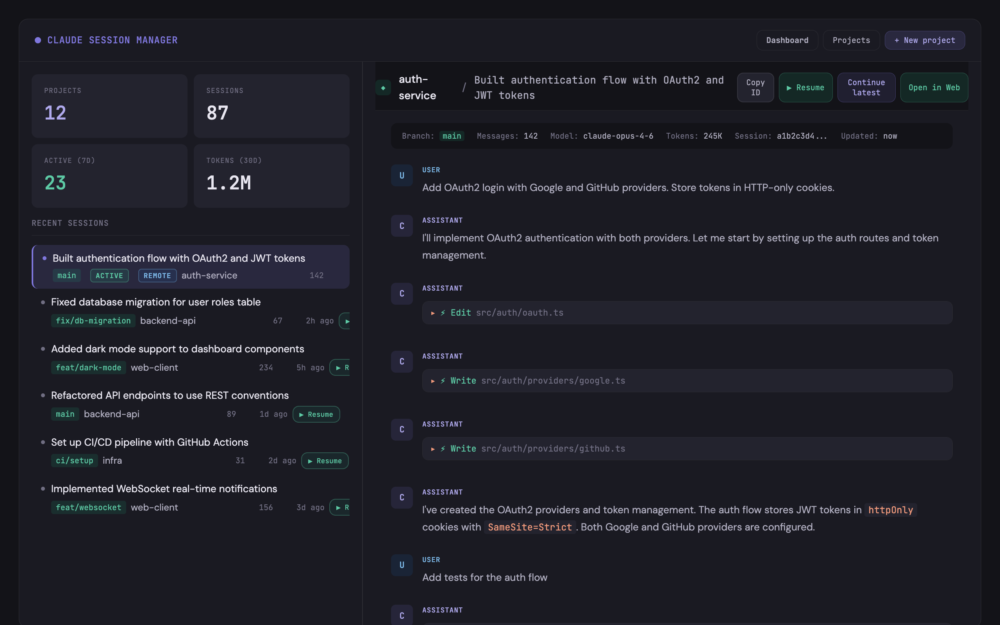
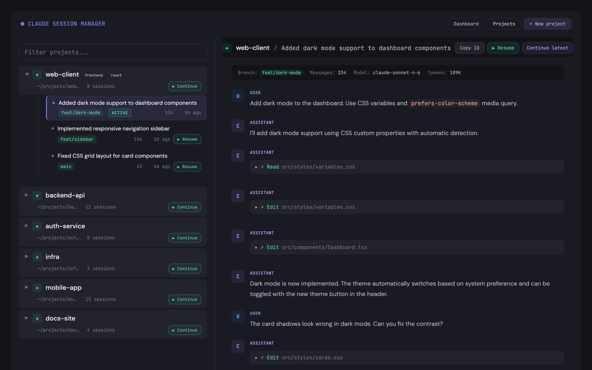
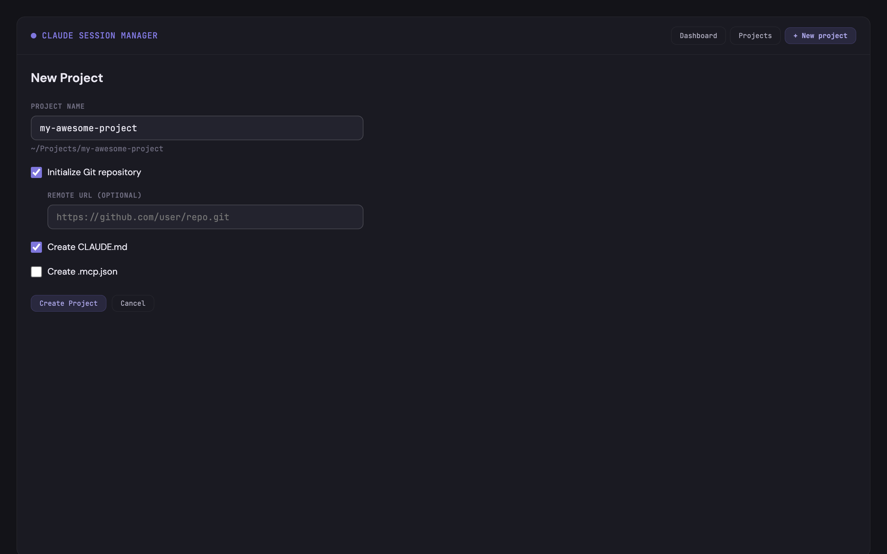

# Claude Code Session Manager

> ⚠️ **WARNING: THIS PROJECT IS EXPERIMENTAL AND HAS A LOT OF SECURITY RISKS. USE AT YOUR OWN RISK.** ⚠️

A local GUI for browsing Claude Code session history, managing projects, and launching sessions.

Built with Deno — reads your `~/.claude/` data read-only and serves a web UI at `127.0.0.1:3456`.

## Screenshots

**Dashboard** — AI-generated summaries, ACTIVE/REMOTE badges, inline transcript preview



**Projects** — 2-pane layout with filterable project list and inline transcript



**New Project Wizard** — Create projects with git init, CLAUDE.md, .mcp.json templates



## Quick Start

```bash
# Requires Deno 2.x
PROJECTS_ROOT=~/my-projects deno task dev
```

Opens http://127.0.0.1:3456 with:

- **Dashboard** — Stats + 10 most recent sessions with AI summaries, click to preview transcript
- **Projects** — Filterable project list with expandable sessions, inline transcript pane
- **New Project** — Wizard to create project directory with git init and templates

## Features

- Discovers all projects from `~/.claude/projects/` automatically
- Streams large JSONL session files without loading fully into memory
- **2-pane layout** — browse sessions on the left, read transcripts on the right
- **AI-generated summaries** — Claude Haiku generates descriptive session titles in the background
- **Launch sessions** — Resume or Continue in Terminal.app, or Open in Web for remote access
- **New Project Wizard** — create directory, git init, CLAUDE.md/.mcp.json templates
- **Per-project settings** — display name, tags, preferred model, custom launch flags
- **Status badges** — ACTIVE (running), REMOTE (connected to claude.ai/code), SBX/NATIVE (sandboxed)
- **Per-project sandboxing** — isolate projects in Docker Sandbox VMs (`sbx` CLI) or Claude Code's native Seatbelt sandbox
- **Sandbox lifecycle management** — create, stop, remove sandboxes from the UI; credential delegation via `sbx secret`
- **Whole-application sandboxing** — run the entire app inside a Docker container via `Dockerfile.sandbox`
- Tool calls paired with results for clean transcript display
- Dark/light mode via system preference
- Read-only — enforced by Deno's `--deny-write=$HOME/.claude` permission

## Commands

| Command | Description |
|---------|-------------|
| `deno task dev` | Dev server with auto-reload (port 3456) |
| `deno task dev:sandbox` | Dev server with sandbox support (`sbx` CLI enabled) |
| `deno task start` | Production server |
| `deno task start:sandbox` | Production server with sandbox support |
| `deno task test` | Run unit and E2E tests |
| `deno task check` | TypeScript type check |

Set `PROJECTS_ROOT` to control where new projects are created (default: `~/Projects`).

## Tech Stack

- **Runtime**: Deno 2.x
- **Backend**: Hono (JSR)
- **Frontend**: Preact + HTM via CDN (no build step)
- **Styling**: Custom CSS with variables, dark mode, responsive

## Docs

- [Architecture](docs/architecture.md) — System design, data flow, directory structure
- [API Reference](docs/api.md) — REST endpoint documentation

## Roadmap

- [x] Phase 1: Core reader — session parser, project discovery, web GUI
- [x] Phase 2: Session launcher — terminal + web launch, remote-control URL detection
- [x] Phase 3: Project wizard + settings — create projects, per-project metadata
- [x] Phase 3.5: Sandboxing — per-project Docker Sandbox/native isolation, credential delegation, lifecycle management
- [ ] Phase 4: Live updates — activity heatmap, file watching (SSE)
- [ ] Phase 5: Polish — keyboard shortcuts, theme toggle, HTML export
